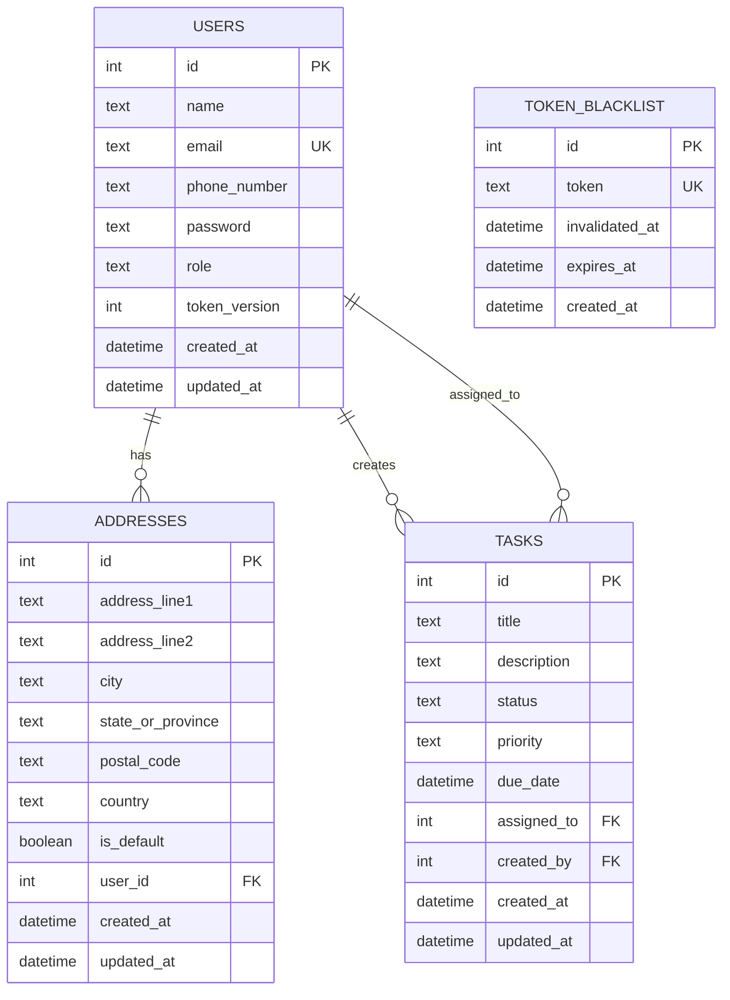

# Task Management API

A complete task management API built with **Cloudflare Workers**, **TypeScript**, and **D1 Database** (SQLite).

## 🚀 **Setup Instructions**

### **Prerequisites**

- Node.js 18+ installed
- npm or yarn package manager
- Cloudflare account for deployment

### **1. Installation**

```bash
# Clone the repository
git clone <repository-url>
cd collars-assignment

# Install dependencies
npm install
```

### **2. Environment Configuration**

```bash
# Create environment file for local development
touch .dev.vars

# Add required environment variables:
# JWT_SECRET=your-super-secret-jwt-key
# (Add other environment variables as needed)
```

### **3. Database Setup & Migrations**

**IMPORTANT: Execute the following commands to set up the database schema:**

```bash
# Create the D1 database (if not already created)
npx wrangler d1 create collars-db

# Apply all database migrations in order
npx wrangler d1 migrations apply collars-db --local   # For local development
npx wrangler d1 migrations apply collars-db           # For production

# Verify migrations were applied successfully
npx wrangler d1 execute collars-db --local --command="SELECT name FROM sqlite_master WHERE type='table';"
```

### **4. Local Development**

```bash
# Start local development server
npm run dev

# The API will be available at http://localhost:8787
```

### **5. Production Deployment**

```bash
# Deploy to Cloudflare Workers
npm run deploy
```

---

## 📚 **API Documentation**

### **Complete API Reference**

The API is fully documented using **Bruno API Collection** located in `/api_docs/`:

```
api_docs/
├── auth/                 # Authentication endpoints
│   ├── login.bru        # POST /auth/login
│   └── logout.bru       # POST /auth/logout
├── users/               # User management (Admin only)
│   ├── create-user.bru  # POST /users
│   ├── get-all-users.bru # GET /users
│   └── get-single-user.bru # GET /users/:id
├── tasks/               # Task CRUD operations
│   ├── 01-get-all-tasks.bru # GET /tasks (with filters)
│   ├── 02-get-task-by-id.bru # GET /tasks/:id
│   ├── 03-create-task.bru    # POST /tasks
│   ├── 04-update-task.bru    # PUT /tasks/:id
│   └── 05-delete-task.bru    # DELETE /tasks/:id
├── assignments/         # Task assignment system
│   ├── 01-assign-task.bru    # POST /tasks/:id/assign
│   ├── 02-unassign-task.bru  # DELETE /tasks/:id/assign
│   ├── 03-get-user-tasks.bru # GET /users/:id/tasks
│   └── 04-get-task-assignments.bru # GET /tasks/:id/assignments
└── environments/
    └── Local.bru        # Environment configuration
```

### **How to Use API Documentation**

1. **Install Bruno**: Download from [bruno.dev](https://bruno.dev)
2. **Open Collection**: Import the `/api_docs` folder
3. **Configure Environment**: Set variables in `environments/Local.bru`
4. **Test Endpoints**: All requests include examples and expected responses

### **Key Endpoints**

| Method | Endpoint | Description | Auth Required |
|--------|----------|-------------|---------------|
| `POST` | `/auth/login` | User authentication | No |
| `POST` | `/auth/logout` | User logout | Yes |
| `GET` | `/tasks` | List tasks with pagination & filters | Yes |
| `POST` | `/tasks` | Create new task | Yes |
| `PUT` | `/tasks/:id` | Update task | Yes |
| `DELETE` | `/tasks/:id` | Delete task | Yes |
| `POST` | `/tasks/:id/assign` | Assign task to user | Yes |
| `GET` | `/users/:id/tasks` | Get user's tasks | Yes |
| `GET` | `/users` | List users | Admin |
| `POST` | `/users` | Create user | Admin |

---

## 🧪 **Testing Approach**

### **Testing Framework**

- **Vitest** with `@cloudflare/vitest-pool-workers`
- **Cloudflare Workers** runtime environment
- **TypeScript** support for type-safe tests

### **Test Configuration**

```typescript
// vitest.config.mts
import { defineWorkersConfig } from '@cloudflare/vitest-pool-workers/config';

export default defineWorkersConfig({
  test: {
    poolOptions: {
      workers: {
        wrangler: { configPath: './wrangler.jsonc' },
      },
    },
  },
});
```

### **Testing Strategy**

1. **Unit Tests**: Individual function testing
2. **Integration Tests**: Full endpoint testing
3. **Authentication Tests**: JWT and middleware testing
4. **Database Tests**: Query and migration testing
5. **Error Handling Tests**: Validation and error scenarios

### **Running Tests**

```bash
# Run all tests
npm run test

# Run tests with coverage report
npm run test:coverage

# Run tests in watch mode
npm run test:watch
```

---

## 🏗️ **Architecture Decisions**

### **1. Domain-Driven Design**

**Decision**: Organized code by business domains rather than technical layers
**Rationale**:

- Better separation of concerns
- Easier to scale and maintain
- Clear business logic boundaries
- Facilitates team collaboration

```src/domains/
├── auth/        # Authentication & authorization
├── users/       # User management
├── tasks/       # Task operations
└── assignments/ # Task-user relationships
```

### **2. Functional Programming Approach**

**Decision**: Pure functions for handlers and utilities
**Rationale**:

- Predictable behavior and easier testing
- Better error handling and debugging
- Reduced side effects
- Improved code reusability

### **3. Middleware-First Architecture**

**Decision**: Composable middleware for cross-cutting concerns
**Rationale**:

- Consistent authentication across routes
- Reusable validation logic
- Clean separation of request processing
- Easy to test and maintain

```typescript
// Example middleware composition
tasksRouter.post('/',
  requireAuth,      // Authentication
  requireJSON,      // Content-type validation
  requireFields(['title', 'description']), // Field validation
  createTaskHandler // Business logic
);
```

### **4. Cloudflare Workers + D1 Database**

**Decision**: Serverless-first architecture with edge computing
**Rationale**:

- Global distribution and low latency
- Auto-scaling and cost efficiency
- Integrated database with SQLite compatibility
- Zero infrastructure management

### **5. Token Versioning over Blacklisting**

**Decision**: User token versioning for logout functionality
**Rationale**:

- More efficient than token blacklisting
- Instant invalidation of all user tokens
- Reduced database storage requirements
- Better performance at scale

---

## 📊 **Unit Test Reports & Coverage**

### **Current Test Coverage**

```bash
# Generate coverage report
npm run test:coverage
```

**Expected Coverage Areas:**

- **Handlers**: Business logic testing
- **Middleware**: Authentication and validation
- **Utilities**: Helper functions and validators
- **Database Operations**: Query logic and error handling

### **Test Structure**

```
test/
├── unit/
│   ├── auth/
│   │   └── index.spec.ts     # Authentication tests
│   ├── tasks/
│   │   └── handlers.spec.ts  # Task handler tests
│   └── users/
│       └── handlers.spec.ts  # User handler tests
├── env.d.ts                  # Test environment types
└── index.spec.ts            # Main router tests
```

### **Coverage Goals**

- **Minimum Target**: 80% code coverage
- **Handler Functions**: 100% coverage
- **Utility Functions**: 95% coverage
- **Middleware**: 90% coverage
- **Error Scenarios**: Comprehensive edge case testing

### **Sample Test Report**

```
 ✓ test/index.spec.ts (1)
 ✓ test/unit/auth/index.spec.ts (5)
 ✓ test/unit/tasks/handlers.spec.ts (12)
 ✓ test/unit/users/handlers.spec.ts (8)

 Test Files  4 passed (4)
 Tests       26 passed (26)

 Coverage Report:
 File         | % Stmts | % Branch | % Funcs | % Lines
 All files    |   85.2  |   78.9   |   92.1  |   84.8
 ```

---

## 🗄️ **SQL Schema Migration Scripts**

### **Database Entity-Relationship Diagram**



### **Migration System**

- **Versioned migrations** with incremental numbering
- **Forward-only** migrations for production safety
- **Automated timestamps** and triggers
- **Performance optimizations** with strategic indexing

### **Available Migrations**

```
migrations/
├── 0001-user-addresses-migration.sql    # Users and addresses tables
├── 0002-task-migration.sql              # Tasks table with constraints
├── 0003-task-assignment-migration.sql   # Task assignments (placeholder)
├── 0004-add-password-to-user.sql        # Password field addition
├── 0006-add-token-version-to-users.sql  # Token versioning system
└── 0007-create-token-blacklist-table.sql # Alternative token management
```

### **Schema Overview**

#### **Users Table**

```sql
CREATE TABLE users (
  id INTEGER PRIMARY KEY AUTOINCREMENT,
  name TEXT NOT NULL,
  email TEXT UNIQUE CHECK (instr(email, '@') > 1) NOT NULL,
  phone_number TEXT NOT NULL,
  password TEXT NOT NULL,
  role TEXT CHECK (role IN ('admin', 'user')) DEFAULT 'user' NOT NULL,
  token_version INTEGER DEFAULT 1,
  created_at DATETIME DEFAULT CURRENT_TIMESTAMP,
  updated_at DATETIME DEFAULT CURRENT_TIMESTAMP
);
```

#### **Tasks Table**

```sql
CREATE TABLE tasks (
  id INTEGER PRIMARY KEY AUTOINCREMENT,
  title TEXT NOT NULL,
  description TEXT NOT NULL,
  status TEXT CHECK (status IN ('pending', 'in_progress', 'completed')) DEFAULT 'pending',
  priority TEXT CHECK (priority IN ('low', 'medium', 'high')) DEFAULT 'medium',
  due_date DATETIME NOT NULL,
  assigned_to INTEGER,
  created_by INTEGER NOT NULL,
  created_at DATETIME DEFAULT CURRENT_TIMESTAMP,
  updated_at DATETIME DEFAULT CURRENT_TIMESTAMP,
  FOREIGN KEY (assigned_to) REFERENCES users(id) ON DELETE SET NULL,
  FOREIGN KEY (created_by) REFERENCES users(id) ON DELETE CASCADE
);
```

### **Performance Indexes**

```sql
-- Users table indexes
CREATE INDEX idx_users_email ON users(email);
CREATE INDEX idx_users_created_at ON users(created_at);

-- Tasks table indexes
CREATE INDEX idx_tasks_status ON tasks(status);
CREATE INDEX idx_tasks_priority ON tasks(priority);
CREATE INDEX idx_tasks_assigned_to ON tasks(assigned_to);
CREATE INDEX idx_tasks_due_date ON tasks(due_date);
CREATE INDEX idx_tasks_assigned_status ON tasks(assigned_to, status);
```

### **Running Migrations**

```bash
# List available migrations
npx wrangler d1 migrations list collars-db

# Apply specific migration
npx wrangler d1 migrations apply collars-db --local

# Check migration status
npx wrangler d1 execute collars-db --command="SELECT * FROM d1_migrations;"
```

---

## 🛠️ **Technologies Used**

- **Runtime**: Cloudflare Workers
- **Language**: TypeScript
- **Database**: D1 Database (SQLite)
- **Authentication**: JWT with token versioning
- **Testing**: Vitest with Workers support
- **API Documentation**: Bruno API Collection
- **Validation**: Custom utility functions
- **Architecture**: Functional programming + Domain-driven design

---

## 🚀 **Implemented Features**

### ✅ **Complete Authentication & Authorization**

- **JWT Authentication** with custom middleware
- **Role-based Access Control** (Admin/User)
- **Token Versioning** for logout from all devices
- **Token Blacklist** for secure invalidation
- `requireAuth` and `requireAdmin` middleware

### ✅ **Complete Task CRUD**

- **GET /tasks** - List with advanced pagination and filters
- **GET /tasks/:id** - Get specific task
- **POST /tasks** - Create new task
- **PUT /tasks/:id** - Update task (partial)
- **DELETE /tasks/:id** - Delete task

### ✅ **Task Assignment System**

- **POST /tasks/:id/assign** - Assign task to user
- **DELETE /tasks/:id/assign** - Unassign task
- **GET /users/:id/tasks** - Get user's assigned tasks (with filters)
- **GET /tasks/:id/assignments** - Get task assignment information

### ✅ **Advanced Features**

- **Pagination & Filters**: Advanced query capabilities
- **Rate Limiting**: Differentiated limits for auth/unauth users
- **Database Optimization**: Strategic indexing and query optimization
- **Error Handling**: Standardized responses and logging
- **Serverless Deployment**: Cloudflare Workers with global distribution

---

## 📋 **Implementation Status**

### ✅ **Completed Features**

- [x] Authentication & Authorization (JWT + Token Versioning)
- [x] Complete Task CRUD with advanced filtering
- [x] Task Assignment System
- [x] Database Migrations & Optimization
- [x] Error Handling & Validation
- [x] API Documentation (Bruno Collection)
- [x] Serverless Deployment (Cloudflare Workers)
- [x] Rate Limiting & Security
- [x] Logging & Monitoring

### ⚠️ **Pending**

- [ ] AI Bonus Features
- [ ] Advanced CI/CD Pipeline
---

## 📚 **Additional Documentation**

- **[Technical Requirements](./TECHNICAL_REQUIREMENTS.md)** - Implementation decisions for technical requirements
- **[Bonus Features](./BONUS_FEATURES.md)** - Bonus points implementation status
- **[API Documentation](./api_docs/README.md)** - Complete Bruno collection guide
